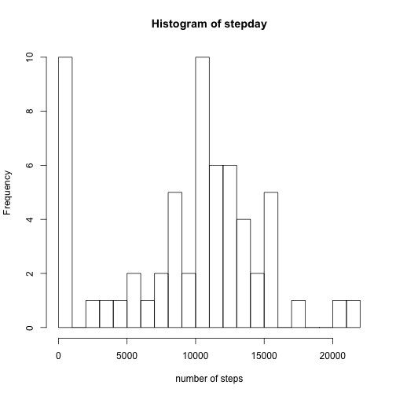
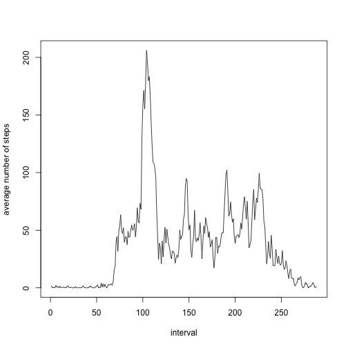
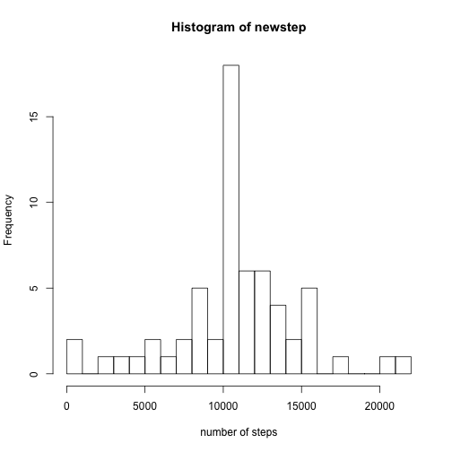
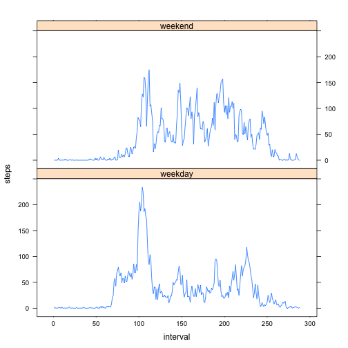

<<<<<<< HEAD
# Reproducible research assignment 1


## 1. Loading and preprocessing the data

This code is used to load the data and process thedata

```r
data <- read.csv("activity.csv",na.strings = "NA")
summary(data)
```

```
##      steps                date          interval     
##  Min.   :  0.00   2012-10-01:  288   Min.   :   0.0  
##  1st Qu.:  0.00   2012-10-02:  288   1st Qu.: 588.8  
##  Median :  0.00   2012-10-03:  288   Median :1177.5  
##  Mean   : 37.38   2012-10-04:  288   Mean   :1177.5  
##  3rd Qu.: 12.00   2012-10-05:  288   3rd Qu.:1766.2  
##  Max.   :806.00   2012-10-06:  288   Max.   :2355.0  
##  NA's   :2304     (Other)   :15840
```

## 2. What is mean total number of steps taken per day


```r
stepday <- tapply(data$steps,data$date,sum,na.rm=TRUE)
hist(stepday,breaks=20,xlab = "number of steps")
```



This is to calculate the median and mean of total number of steps


```r
median(stepday)
```

```
## [1] 10395
```

```r
mean(stepday)
```

```
## [1] 9354.23
```

## 3. What is the average daily activity pattern?
### make the plot

```r
data$interval <- as.factor(data$interval)
interstep <- tapply(data$steps,data$interval,mean,na.rm=TRUE)
plot(as.numeric(unique(data$interval)),interstep,type="l",xlab="interval",ylab="average number of steps")
```



### which contains the maximum

```r
interstep[which.max(interstep)]
```

```
##      835 
## 206.1698
```

## 4. Imputing missing values
### total nubmer of missing values

```r
sum(is.na(data$steps))
```

```
## [1] 2304
```

### fill the missing value based on mean of the 5 min interval


```r
newdata <- data
naindex <- which(is.na(data$steps))
xy <- data$interval[naindex]
xy <- as.character(data$interval[naindex])
substi <- as.numeric(vector())
for (i in xy){substi <- c(substi,interstep[i])}
newdata$steps[naindex] <- substi
summary(newdata)
```

```
##      steps                date          interval    
##  Min.   :  0.00   2012-10-01:  288   0      :   61  
##  1st Qu.:  0.00   2012-10-02:  288   5      :   61  
##  Median :  0.00   2012-10-03:  288   10     :   61  
##  Mean   : 37.38   2012-10-04:  288   15     :   61  
##  3rd Qu.: 27.00   2012-10-05:  288   20     :   61  
##  Max.   :806.00   2012-10-06:  288   25     :   61  
##                   (Other)   :15840   (Other):17202
```

### plot histogram


```r
newstep <- tapply(newdata$steps,newdata$date,sum)
hist(newstep,breaks = 20,xlab = "number of steps")
```



mean and median total number of steps taken per day

```r
mean(newstep)
```

```
## [1] 10766.19
```


```r
median(newstep)
```

```
## [1] 10766.19
```

Both values shifted compared with the previous results

## 5. Are there differences in activity patterns between weekdays and weekends

### Create new factor variable


```r
weekday <- c("Monday","Tuesday","Wednesday","Thursday","Friday")
weekend <- c("Saturday","Sunday")
week <- as.character(weekdays(as.Date(data$date)))
week[week %in% weekday] <- "weekday"
week[week %in% weekend] <- "weekend"
data$newcolumn <- week
head(data)
```

```
##   steps       date interval newcolumn
## 1    NA 2012-10-01        0   weekday
## 2    NA 2012-10-01        5   weekday
## 3    NA 2012-10-01       10   weekday
## 4    NA 2012-10-01       15   weekday
## 5    NA 2012-10-01       20   weekday
## 6    NA 2012-10-01       25   weekday
```


```r
levels(as.factor(data$newcolumn))
```

```
## [1] "weekday" "weekend"
```

### Make new plot for weekday and weekends


```r
library(reshape2)
groupinter <- tapply(data$steps,list(data$interval,data$newcolumn),mean,na.rm=TRUE)
groupinter <- data.frame(groupinter)
groupinter <- cbind(groupinter,unique(data$interval))
names(groupinter)[3] <- "interval"
melted <- melt(groupinter,id.vars = "interval" ,variable.name = "time", value.name = "steps")
head(melted)
```

```
##   interval    time     steps
## 1        0 weekday 2.3333333
## 2        5 weekday 0.4615385
## 3       10 weekday 0.1794872
## 4       15 weekday 0.2051282
## 5       20 weekday 0.1025641
## 6       25 weekday 1.5128205
```


```r
library(lattice)
melted$interval <- as.numeric(melted$interval)
xyplot(steps~interval|time,melted,type="l",layout=c(1,2),scales =list(x=list(tick.number=5, tck=0.1)))
```




